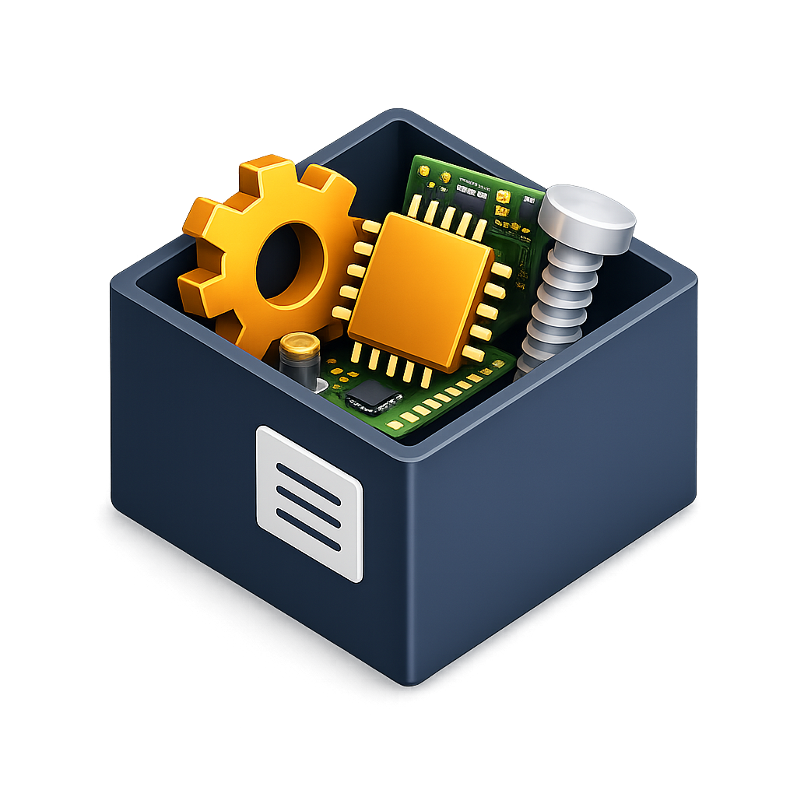

# ⚡ ElectromTech StockFlow — Kurumsal Stok & Proje Yönetim Sistemi

<div align="center">

  

  ### **ElektromTech Elektronik İçin Geliştirilmiş Tam Yığın (Full-Stack) PWA Stok & Proje Takip Platformu**

  [](https://reactjs.org/)
  [](https://www.typescriptlang.org/)
  [](https://nodejs.org/)
  [](https://expressjs.com/)
  [](https://www.postgresql.org/)
  [](https://www.prisma.io/)
  [](https://www.docker.com/)
  [](https://web.dev/progressive-web-apps/)

</div>

---

## 📖 Proje Hakkında

**ElectromTech StockFlow**, elektronik bileşenler (SMD/THT dirençler, kondansatörler, entegreler, yarı iletkenler vb.) ve üretim projeleri yönetimi için özel olarak tasarlanmış, **Progressive Web App (PWA)** standartlarında geliştirilmiş kurumsal bir stok takip ve proje atama sistemidir.

Depo ve saha çalışanlarının zayıf veya kesintili internet bağlantılarında bile **çevrimdışı (offline-first)** stok sayımı yapabilmesini, internet geldiğinde otomatik senkronizasyon sağlayan mimarisi ile kesintisiz bir iş akışı sunar.

---

## ✨ Öne Çıkan Özellikler

### 📊 1. Canlı & İnteraktif Dashboard (Analytics)
- **Stok Özeti Kartları:** Toplam Ürün Sayısı, Toplam Stok Miktarı, Kritik Stok Uyarısı, Günlük Stok Giriş/Çıkış Hareketleri ve En Çok Kullanılan Malzeme analizi.
- **Dinamik Grafikler:** Recharts destekli Kategori Dağılım Donut Chart ve Kritik Stok Seviyeleri (Progress Bar).
- **Hızlı Erişim Grid'i:** Kategori bazlı stok miktarlarına doğrudan erişim paneli.

### 📋 2. Proje Yönetimi ve Çift Yönlü Malzeme Ataması (New 🚀)
- **Proje CRUD & Takibi:** Proje oluşturma, düzenleme, silme ve durum yönetimi (*Planlama, Aktif, Tamamlandı, İptal*).
- **Esnek Ürün Bağlama:**
  1. Proje oluşturma modalında sistemdeki malzemelerden stok miktarı ve not belirterek ürün ekleme.
  2. Ürün Detay Sayfası (`ProductDetailPage`) üzerinden malzemeleri projelere bağlama veya çıkarma.

### 🌳 3. Çok Katmanlı Özyinelemeli Kategori Mimarisi
- Sınırsız derinlikte alt kategori desteği (ör: *Pasif Elemanlar ➔ Direnç ➔ SMD Direnç ➔ 0805 Kılıf*).
- PostgreSQL **Recursive CTE** (Common Table Expression) optimizasyonu sayesinde 85ms altı milisaniyelik hiyerarşik sorgu yanıtları.
- Kategoriye özel dinamik form parametreleri (Direnç için *Tolerans/Watt*, Kondansatör için *Kapasite/Voltaj*).

### ⚡ 4. Çevrimdışı (Offline-First) ve PWA Mimarisi
- `Dexie.js` (IndexedDB) yerel tarayıcı veritabanı entegrasyonu.
- İnternet kesildiğinde yapılan tüm stok hareketlerinin `syncQueue` yapısında saklanması ve bağlantı döndüğünde otomatik sunucu senkronizasyonu.
- Mobil cihazlarda yerel uygulama hissi veren **5 sekmeli responsive Bottom Navigation** ve yükleme istemi.

### 🔒 5. Güvenlik ve Denetim Kayıtları (Audit Logs)
- **JWT Yetkilendirme:** 15 dakikalık Access Token ve HTTP-Only Cookie bazlı Refresh Token rotasyonu.
- **Optimistic Locking:** Eşzamanlı stok güncellemelerinde çakışmayı önleyen `version` alanlı veri bütünlüğü kontrolü.
- **Audit Logs:** Sistemdeki her ürün ekleme, stok düşme veya güncelleme eyleminin öncesi/sonrası JSON snapshot kaydedimi.
- **Web Push Bildirimleri:** Kritik stok sınırının altına düşen ürünlerde anlık tarayıcı/mobil bildirimi.

---

## 🛠️ Teknoloji Yığını (Tech Stack)

### **Frontend**
- **Core:** React 18, TypeScript, Vite
- **Styling:** Tailwind CSS, Shadcn UI, Lucide Icons, Glassmorphism UI
- **State & Data:** TanStack Query (React Query v5), Context API
- **Charts:** Recharts
- **Offline DB:** Dexie.js (IndexedDB)
- **PWA:** Vite PWA Plugin, Workbox Service Worker

### **Backend**
- **Runtime:** Node.js (v20 LTS), Express.js (TypeScript)
- **ORM:** Prisma ORM v6
- **Database:** PostgreSQL 15 (Docker & Supabase Cloud uyumlu)
- **Security:** Bcrypt.js, JSON Web Tokens (JWT), Express Rate Limit, Helmet, CSRF Protection
- **Push:** Web-Push VAPID Protocol

### **DevOps & Altyapı**
- **Containerization:** Docker & Docker Compose (Multi-stage Nginx + Node.js build)
- **Web Server:** Nginx Stable Alpine

---

## 📂 Proje Dizin Yapısı

```text
ElektromTech_Stok/
├── backend/                  # Express.js RESTful API & Prisma ORM
│   ├── prisma/
│   │   ├── schema.prisma     # Veritabanı Modelleri (Product, Category, Project, User...)
│   │   └── migrations/       # Veritabanı Migrasyon Kayıtları
│   ├── src/
│   │   ├── controllers/      # API Mantık İletimi (products, projects, dashboard...)
│   │   ├── routes/           # Endpoint Tanımları
│   │   ├── middlewares/      # Auth, Rate Limit, Audit Log Middleware'leri
│   │   └── sync-data.ts      # Canlı/Lokal Veri Aktarım Scripti
│   └── Dockerfile
├── frontend/                 # React + TypeScript Vite PWA
│   ├── src/
│   │   ├── api/              # Axios Client & Offline Fallback Fonksiyonları
│   │   ├── components/       # UI & Layout Bileşenleri
│   │   ├── pages/            # Ekranlar (Dashboard, Projects, Search, Settings...)
│   │   ├── lib/              # Dexie.js Önbellek Mimarisi
│   │   └── types/            # TypeScript Interface & Enum Tanımları
│   └── Dockerfile
├── docker-compose.yml        # Üretim & Geliştirme Konteyner Orkestrasyonu
└── README.md
```

---

## 🚀 Hızlı Kurulum ve Çalıştırma

### 🐳 Yöntem A: Docker Compose İle (Önerilen)

Tüm sistemi (PostgreSQL veritabanı, Backend API ve Nginx Frontend) tek komutla ayağa kaldırabilirsiniz:

```bash
# 1. Depoyu klonlayın
git clone https://github.com/mhmtdmr155/StockFlow.git
cd StockFlow

# 2. Docker Konteynerlarını Başlatın
docker-compose up -d --build
```

Uygulama yayında:
- 🌐 **Frontend (Production):** [http://localhost](http://localhost) (Port 80)
- 🔌 **Backend API:** [http://localhost:5000](http://localhost:5000)

---

### 💻 Yöntem B: Lokal Geliştirme (Development)

#### 1. Backend Kurulumu
```bash
cd backend
npm install
npx prisma db push
npx prisma db seed
npm run dev
```

#### 2. Frontend Kurulumu
```bash
cd frontend
npm install
npm run dev
```

Erişim: `http://localhost:5173`

---


## 🌐 API Uç Noktaları (Endpoints Summary)

### **Auth & Kullanıcılar**
- `POST /api/login` — Kullanıcı girişi & Refresh Cookie üretimi
- `POST /api/refresh-token` — Access Token yenileme
- `GET /api/users` — Kullanıcı listesi *(Admin)*

### **Ürünler & Stok**
- `GET /api/products` — Filtrelenebilir ürün listesi
- `POST /api/products` — Yeni ürün oluşturma *(Admin)*
- `PUT /api/products/:id` — Ürün güncelleme (Optimistic Locking)
- `POST /api/products/import` — Toplu Excel/JSON ürün aktarımı
- `DELETE /api/products/clear-samples` — Örnek test verilerini sıfırlama

### **Projeler (Projects)**
- `GET /api/projects` — Tüm projeleri ve malzeme sayılarını listeleme
- `POST /api/projects` — Yeni proje oluşturma ve malzeme ekleme
- `POST /api/projects/:id/products` — Projeye ürün atama / çıkarma

---

## 👤 Geliştirici & Lisans

- **Geliştirici:** Mehmet Demir
- **Firma / Müşteri:** ATN Yazılım — ElektromTech Elektronik
- **Lisans:** [MIT License](LICENSE)
